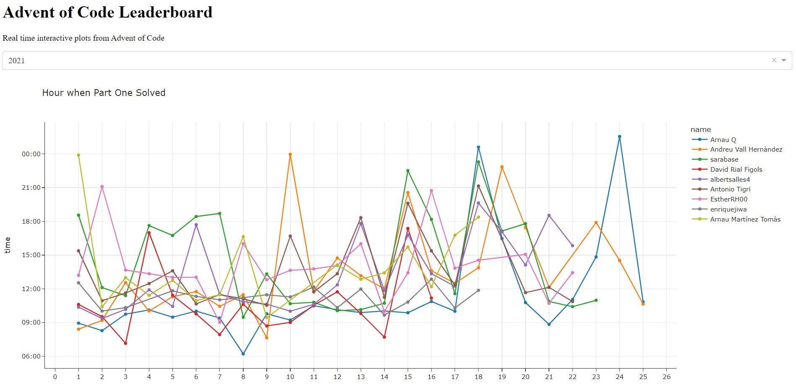

# Advent of Code Leaderboard
Deployed on [Heorku](https://advent-of-code-leaderboard.herokuapp.com/)

As always default dark themes continue to suck

## Prerequisites
- python >= 3.10

## Install
```
python -3.10 -m venv myenv
./myenv/Scripts/activate
pip install -r requirements.txt
```

## Usage
```
./myenv/Scripts/activate
python dash_app.py
```


